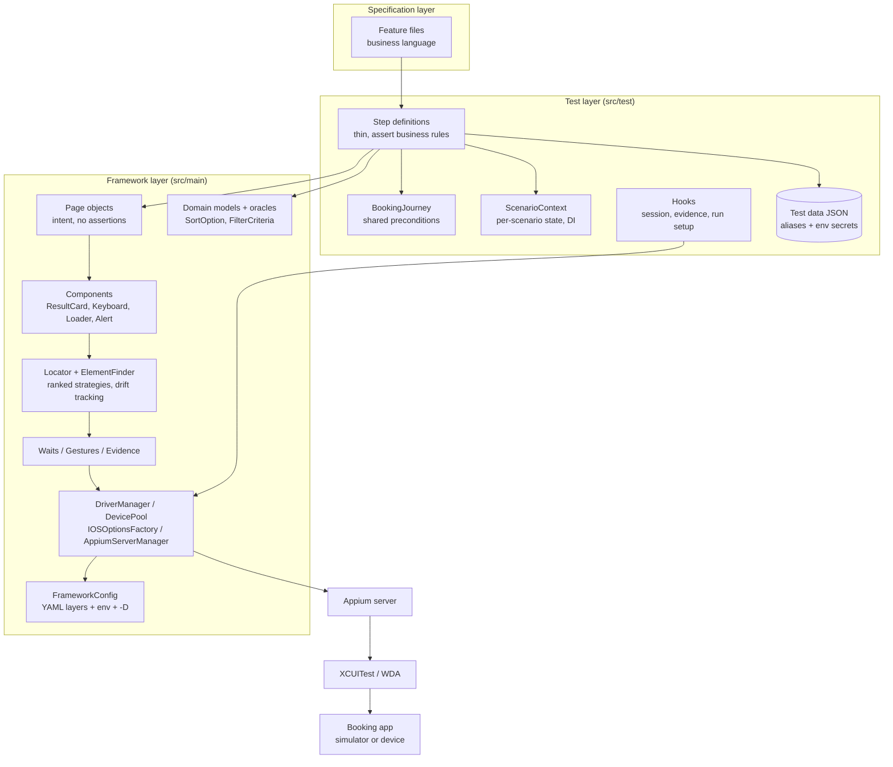
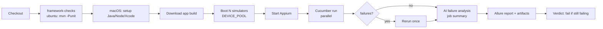

# iOS Booking Automation Framework

Native iOS UI automation for a Booking application, built as a **Senior SDET technical challenge**:
Appium 2 (XCUITest) + Java 17 + Cucumber 7 + TestNG + Allure, with an **AI-agent workflow** and the
**Appium MCP server** used as engineering accelerators - never as a substitute for review.

> **What makes it different from a typical POM framework**
> - **Business-rule oracles**, not click-checks: sort order is verified pair-by-pair over a harvested sample,
>   filters are verified on every result, and the details screen is checked against *the card the user tapped*.
> - **Locator drift detection**: every locator has a ranked fallback; when a fallback is used the test keeps
>   running and the change is reported (`target/locator-drift-report.json`) *before* it breaks the suite.
> - **Executable guardrails for AI-generated code**: `CodeConventionsTest` fails the build on `Thread.sleep`,
>   legacy Appium APIs, assertions in page objects or UI words in Gherkin - the same rules the agents read in `CLAUDE.md`.
> - **Two-layer AI failure analysis**: deterministic clustering/classification first, Claude hypotheses second.
> - **Parallel-safe by design**: device pool with per-thread simulator + WDA port leasing, thread-confined sessions.

---

## Contents
1. [Technology stack](#1-technology-stack)
2. [Architecture](#2-architecture)
3. [Project structure](#3-project-structure)
4. [Environment setup](#4-environment-setup)
5. [iOS simulator / real device setup](#5-ios-simulator--real-device-setup)
6. [Appium setup](#6-appium-setup)
7. [Appium MCP setup](#7-appium-mcp-setup)
8. [Running the tests](#8-running-the-tests)
9. [Reporting](#9-reporting)
10. [CI/CD](#10-cicd)
11. [AI approach](#11-ai-approach)
12. [Design decisions](#12-design-decisions)
13. [Adapting to the real app (first hour checklist)](#13-adapting-to-the-real-app-first-hour-checklist)

Further reading: [Architecture & senior Q&A](docs/ARCHITECTURE.md) · [Exploratory testing](docs/EXPLORATORY_TESTING.md) ·
[AI usage](docs/AI_USAGE.md) · [Appium MCP](docs/APPIUM_MCP.md)

---

## 1. Technology stack

| Concern | Choice | Version |
|---|---|---|
| Language / build | Java 17, Maven | 3.9+ |
| Mobile driver | Appium 2/3 server + XCUITest driver, Appium Java Client (W3C, `XCUITestOptions`) | java-client 9.4 |
| BDD | Cucumber JVM + PicoContainer DI | 7.20 |
| Runner | TestNG (parallel data provider) | 7.10 |
| Assertions | AssertJ (incl. soft assertions) | 3.26 |
| Reporting | Allure (Cucumber 7 adapter, categories, environment, attachments) | 2.29 |
| Config / data | YAML (layered profiles) + JSON test data via Jackson | 2.18 |
| Logging | SLF4J + Logback (thread + scenario in every line) | 1.5 |
| AI | Claude Code sub-agents, Appium MCP server (`appium-mcp`), Claude API for failure analysis | - |
| CI | GitHub Actions (macOS simulators) + Jenkinsfile (real-device farm) | - |

## 2. Architecture



Full rationale, sequence diagrams and the senior-level Q&A are in [docs/ARCHITECTURE.md](docs/ARCHITECTURE.md).

## 3. Project structure

```
ios-booking-automation/
├── pom.xml                         # deps, surefire (parallel), profiles: unit | rerun
├── CLAUDE.md                       # rules every AI agent must follow (enforced by CodeConventionsTest)
├── .mcp.json                       # Appium MCP server registration for Claude Code
├── .claude/agents/                 # requirement-analyst, locator-scout, automation-engineer, failure-analyst
├── ai/
│   ├── prompts/                    # prompt library per workflow stage
│   ├── mcp/capabilities.json       # session caps used by the MCP server
│   ├── outputs/                    # agent outputs kept for traceability (requirements, locators)
│   └── failure-analyzer/           # analyze_failures.py (rules + optional Claude)
├── docs/                           # architecture, exploratory testing, AI usage, MCP
├── scripts/                        # boot-simulators.sh, start-appium.sh, run-tests.sh
├── .github/workflows/ios-e2e.yml   # PR / nightly pipeline on macOS simulators
├── Jenkinsfile                     # real-device farm pipeline
└── src/
    ├── main/java/com/booking/automation/
    │   ├── config/        FrameworkConfig, PlaceholderResolver
    │   ├── constants/     ConfigKeys, FrameworkConstants
    │   ├── driver/        DriverManager, DriverFactory, DevicePool, DeviceSpec, IOSOptionsFactory,
    │   │                  CapabilityMapper, AppiumServerManager
    │   ├── locators/      Locator, ElementFinder, LocatorDriftTracker
    │   ├── pages/         BasePage, LoginPage, HomePage, SearchPage, SearchResultsPage,
    │   │                  FilterPage, SortPage, BookingDetailsPage
    │   ├── components/    ResultCardComponent, KeyboardComponent, LoadingIndicatorComponent, AlertComponent
    │   ├── models/        ResultItem, SearchCriteria, FilterCriteria, SortOption, SelectionStrategy, ...
    │   ├── data/          TestDataRepository
    │   └── utils/         Waits, Gestures, Evidence, TextParsers
    └── test/
        ├── java/com/booking/automation/
        │   ├── runners/          TestRunner, RerunFailedRunner
        │   ├── stepdefinitions/  Login, Search, Filter, Sort, BookingDetails steps, ParameterTypes
        │   ├── hooks/            ScenarioHooks, GlobalHooks
        │   ├── context/          ScenarioContext, BookingJourney
        │   ├── unit/             oracle, parser, config/data and code-convention tests (no device)
        │   └── driver/           device pool + capability mapping tests (no device)
        └── resources/
            ├── features/         01_login ... 06_booking_journey (.feature)
            ├── testdata/         users, search, filters, sorting, selection, messages (.json)
            ├── config/           default, local, ci, cloud (.yaml)
            ├── testng*.xml, logback-test.xml, allure.properties, categories.json
```

## 4. Environment setup

| Tool | Version | Check |
|---|---|---|
| macOS + Xcode (+ command line tools) | Xcode 15.4+ (iOS 17 SDK) | `xcodebuild -version` |
| JDK | 17+ | `java -version` |
| Maven | 3.9+ | `mvn -v` |
| Node.js | 20 LTS | `node -v` |
| Appium + XCUITest driver | Appium 2.x/3.x | `appium -v && appium driver list --installed` |
| Allure CLI (optional, report served locally) | 2.29+ | `allure --version` |
| Python 3 (failure analyzer) | 3.9+ | `python3 --version` |

```bash
git clone <private-repo-url> && cd ios-booking-automation
cp .env.example .env            # fill BOOKING_USERNAME / BOOKING_PASSWORD / BOOKING_BUNDLE_ID / BOOKING_APP_PATH
set -a; source .env; set +a
mvn -q test -Punit              # device-free sanity check: config, data, oracles, guardrails
```

Credentials are **never** committed: `testdata/users.json` contains `${BOOKING_USERNAME}` placeholders resolved
from the environment (locally from `.env`, in CI from secrets).

## 5. iOS simulator / real device setup

**Simulator (default)**
```bash
xcrun simctl list runtimes                       # make sure the iOS runtime exists
./scripts/boot-simulators.sh 1 "iPhone 15" 17.5  # creates/boots "QA iPhone 15 #1", installs $BOOKING_APP_PATH
```
The script disables the hardware keyboard (so the software keyboard appears), forces `en_US`, and pins the
status bar for stable screenshots. It prints a `DEVICE_POOL` value with UDIDs for parallel runs.

**App build:** a simulator build is a `.app` (`xcodebuild -sdk iphonesimulator ...`), not an `.ipa`. Set
`BOOKING_APP_PATH` to install it per session, or leave it empty and set only `BOOKING_BUNDLE_ID` to attach to an
installed app.

**Real devices** (see `Jenkinsfile`)
- Mac host with Xcode, devices connected via USB/network and **trusted**; Developer Mode enabled on iOS 16+.
- WebDriverAgent must be signed: Apple Developer team id in `XCODE_ORG_ID` (`device.xcodeOrgId`), a development
  certificate + provisioning profile that includes the device UDIDs. Run once manually to trust the developer
  profile on the device (Settings > General > VPN & Device Management).
- App as a development/ad-hoc signed `.ipa` containing the device UDIDs.
- `-Denv=ci -Ddevice.real=true -Ddevice.pool="iPhone 14@<udid>@17.5,iPhone 13@<udid>@16.7"`.
- Keep devices unlocked, auto-lock off, notifications silenced; serialise jobs per device (Jenkins `lock`).
- Device cloud alternative: `-Denv=cloud` (`config/cloud.yaml`, BrowserStack-style `bstack:options`).

## 6. Appium setup

```bash
npm install -g appium
appium driver install xcuitest
appium driver doctor xcuitest     # verifies Xcode, Carthage-free WDA build prerequisites, etc.
```
Either let the framework start Appium (`appium.startLocal: true`, default in `config/local.yaml`) or run
`./scripts/start-appium.sh` and use `-Denv=ci`. The first session builds WebDriverAgent (1-3 min); later sessions
reuse it. CI caches the WDA derived data.

## 7. Appium MCP setup

The repository ships `.mcp.json`, so Claude Code picks the server up automatically:
```bash
claude            # in the repo root; approve the project MCP server when prompted
/mcp              # should list appium-mcp as connected
```
Other MCP clients (Cursor, VS Code, Gemini CLI) use the same block: `npx -y appium-mcp@latest` with
`CAPABILITIES_CONFIG=./ai/mcp/capabilities.json`. Details, the workflow, and how MCP differs from the Java suite:
[docs/APPIUM_MCP.md](docs/APPIUM_MCP.md).

## 8. Running the tests

```bash
mvn test                                                   # default: local profile, all non-@wip scenarios
mvn test -Dcucumber.filter.tags="@smoke"                   # PR gate (6 scenarios incl. full journey)
mvn test -Dcucumber.filter.tags="@regression and not @ux"  # regression subset
mvn test -Dcucumber.filter.tags="@sort"                    # one feature area
mvn test -Denv=ci -Dthreads=3                              # parallel on 3 simulators (DEVICE_POOL with 3 UDIDs)
mvn test -Ddevice.pool="iPhone 15 Pro" -Ddevice.platformVersion=18.0   # any config key can be overridden
mvn test -Prerun                                           # re-run only what failed last time
mvn test -Punit                                            # device-free framework tests
./scripts/run-tests.sh                                     # run -> rerun once -> AI triage -> Allure report
```

**Tags:** `@smoke` (release gate) · `@critical` · `@regression` · `@negative` · `@ux` · `@e2e` ·
per area `@login @search @filter @sort @details` · `@wip` (excluded by default).

**Scenarios** (19 executions from 14 scenario definitions; the 5 required ones are marked ✓)

| Feature | Scenario | Tags |
|---|---|---|
| Login | ✓ User logs in successfully | smoke critical |
| Login | Login rejected - wrong password / unregistered user (outline) | regression negative |
| Login | Keyboard appears and does not block sign in | regression ux |
| Search | ✓ User searches for a booking option | smoke critical |
| Search | Results relevant for London / Cairo (outline) | regression |
| Search | Informed when nothing matches | regression negative |
| Filter | ✓ User filters search results (+ filter remains applied) | smoke critical |
| Filter | Every result respects rating / property-type filter (outline) | regression |
| Filter | Filter survives viewing a stay and coming back | regression |
| Sort | ✓ User sorts search results | smoke critical |
| Sort | Ordered by price asc / price desc / rating (outline) | regression |
| Sort | Sorting keeps the active filter | regression |
| Details | ✓ User opens booking details | smoke critical |
| Journey | Traveller finds, refines and opens a stay (full main journey) | e2e smoke |

## 9. Reporting

```bash
mvn allure:report        # -> target/site/allure-maven-plugin/index.html
mvn allure:serve         # or: allure serve target/allure-results
```

| In the report | Source |
|---|---|
| Pass / fail / broken, duration, history, retries (flaky) | Allure Cucumber adapter + rerun pass |
| Page-object steps ("Search for Paris", "Collect up to 10 results") | `@Step` on page methods (AspectJ) |
| Failure screenshot, XCUITest page source, screen recording | `ScenarioHooks` + `Evidence` |
| Business evidence: harvested results, observed sort order, selected vs details | `Evidence.text(...)` in steps |
| **Categories**: Locator change / Business rule (probable bug) / Sync / Infra / Data | `categories.json` |
| Environment: device pool, iOS version, bundle id, Appium URL, tags | `GlobalHooks` |
| Device per test | `Allure.parameter("Device", ...)` |

Outside Allure: `target/logs/test-run.log` (thread + scenario on each line), `target/appium-server.log`,
`target/locator-drift-report.json`, `target/ai-failure-analysis.md`, Cucumber HTML/JSON in `target/cucumber/`.

## 10. CI/CD

`.github/workflows/ios-e2e.yml`



- PR: `@smoke`, 2 simulators. Nightly: `@regression or @smoke`. Manual: any tags/threads.
- Device-free checks run first on cheap Linux runners and block the expensive macOS job.
- The simulator job is skipped until secrets/variables are configured: see [docs/CI_SETUP.md](docs/CI_SETUP.md).
- Real devices: `Jenkinsfile` targets a labelled Mac agent pool with USB devices; device sets are locked per run.

## 11. AI approach

AI is used at every stage where it accelerates an engineer, with an explicit human gate after each:


What was automated vs. validated by a human, prompts, outputs, corrections and limitations:
[docs/AI_USAGE.md](docs/AI_USAGE.md).

## 12. Design decisions

| Decision | Alternative considered | Why |
|---|---|---|
| Custom `Locator` (ranked strategies) instead of `@iOSXCUITFindBy` PageFactory | PageFactory proxies | Fallbacks + drift reporting; no proxy staleness surprises; locators are plain data the MCP agent can emit |
| Accessibility id > NSPredicate/class chain > XPath | XPath-first | Speed (XPath on iOS serialises the whole tree) and stability; XPath is a code-review exception |
| Pages return state, steps assert | Asserting inside pages | Same page method serves positive and negative scenarios |
| Harvest a sample (default 10) for sort/filter oracles | Check first 3 visible cards | iOS only exposes visible cells; 3 items rarely prove an ordering |
| Selected card -> details comparison | Expected values in test data | Proves the logical link without coupling to live inventory |
| Dates as offsets from today | Fixed dates | Test data never expires |
| PER_SCENARIO session (CI) / PER_THREAD (fast local) | One fixed mode | Isolation vs. speed is a per-pipeline decision |
| One rerun, flagged as flaky | Automatic retries until green | Reruns diagnose; they must not hide instability |
| FluentWait-based `Waits` only, implicit wait 0 | Mixed waits / sleeps | Predictable timeouts, descriptive failures |
| YAML profiles + env + `-D` overrides | Single properties file | Same build runs local, CI, cloud without edits |

## 13. Adapting to the real app (first hour checklist)

The challenge provides the app and credentials separately, so locators and copy are externalised and grouped:

1. Set `BOOKING_BUNDLE_ID`, `BOOKING_APP_PATH`, credentials in `.env`.
2. Run the `locator-scout` agent (prompt `ai/prompts/02-locator-discovery-mcp.md`) screen by screen; replace the
   `Locator.named(...)` primaries in `pages/` with the **verified** ids (current values follow the convention
   `screen_element_role`, proposed to the iOS team in docs/ARCHITECTURE.md).
3. Update app wording in `testdata/sorting.json`, `filters.json`, `messages.json`; pick datasets whose filters
   actually exclude something (the filter step reports when the data cannot prove "list updated").
4. Set `search.setDates` / `search.setGuests` if the app requires them.
5. `mvn test -Dcucumber.filter.tags=@smoke`, then check `target/locator-drift-report.json` - every entry is a
   primary locator still to fix.
6. Record exploratory findings in `docs/EXPLORATORY_TESTING.md` (observation column).
