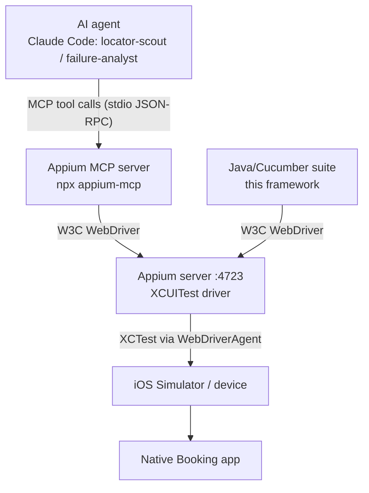

# Appium MCP server in the workflow

## 1. What it is

The **Model Context Protocol (MCP)** is an open standard that lets an AI client (Claude Code, Cursor, VS Code,
Gemini CLI ...) call external *tools* through a uniform interface. **`appium-mcp`** is the official Appium-project
MCP server: it exposes Appium capabilities - create a session, read the element tree, find elements, tap, type,
scroll, take screenshots, suggest locators - as tools the model can call.



Both the agent (through MCP) and the Java suite talk to **the same Appium server and the same app build**, so what
the agent observes is exactly what the tests will see.

## 2. How it differs from traditional Appium automation

| | Java + Appium suite | AI agent + Appium MCP |
|---|---|---|
| Who decides the next action | Code written in advance | The model, at runtime, from what it sees |
| Determinism | Deterministic, repeatable | Non-deterministic, exploratory |
| Purpose | **Regression**: verify known rules on every build | **Design time**: explore, discover locators, reproduce failures |
| Output | Pass/fail + evidence | Knowledge: element tables, locators, repro steps, screenshots |
| Runs in CI as a gate | Yes | No - never a pass/fail gate |
| Cost per run | Low | Model tokens + time |

MCP does **not** replace the suite. It shortens the slowest human loops around it: "what is this element called?",
"why did this fail on the new build?".

## 3. Setup

Prerequisites: Appium + XCUITest driver installed, simulator booted with the app installed (`scripts/boot-simulators.sh`),
Appium running (`scripts/start-appium.sh`).

```jsonc
// .mcp.json (committed) - picked up automatically by Claude Code in this repo
{
  "mcpServers": {
    "appium-mcp": {
      "type": "stdio",
      "command": "npx",
      "args": ["-y", "appium-mcp@latest"],
      "env": { "CAPABILITIES_CONFIG": "./ai/mcp/capabilities.json" }
    }
  }
}
```
```bash
claude mcp add appium-mcp -- npx -y appium-mcp@latest   # alternative: register via CLI
claude                                                   # then /mcp -> appium-mcp: connected
```
`ai/mcp/capabilities.json` mirrors `config/default.yaml` (device, iOS version, bundle id) so the agent explores the
same target as the suite. Tool names and options evolve between `appium-mcp` releases - check the server's tool
list via `/mcp` rather than hard-coding names in prompts; prompts in `ai/prompts/` describe *intent*.

## 4. Where MCP is used in this project

| Activity | Agent | What MCP is used for | Output |
|---|---|---|---|
| Inspecting the application | `locator-scout` | Create session, navigate like a user, capture screenshot + page source per screen | Screen inventory |
| Discovering UI elements / reading accessibility info | `locator-scout` | Read `name`, `label`, `value`, `type`, `visible`, `enabled` from the XCUITest tree | Element table, missing-id list for iOS team |
| Locator discovery | `locator-scout` | Propose primary + fallback, then **find each one** to verify exactly one displayed match | `Locator.named(...)` blocks for pages |
| Navigating / executing interactions | `locator-scout` | Tap, type, scroll, open sheets to reach deep screens (filter, sort, details) | Repro paths |
| Capturing screenshots | both | Evidence attached to locator tables and bug drafts | `ai/outputs/locators/evidence/` |
| Investigating automation failures | `failure-analyst` | Replay the failing steps on the same build; compare live tree with the failure page source | Classification + verified fix |

## 5. Demonstration - workflow walkthrough

**Goal:** implement `SortPage` for the real app without guessing locators.

1. **Start** Appium + simulator; open Claude Code in the repo; `/mcp` shows `appium-mcp` connected.
2. **Prompt** (from `ai/prompts/02-locator-discovery-mcp.md`):
   *"Use the locator-scout agent with appium-mcp. Start an iOS session with ai/mcp/capabilities.json, log in, search
   Paris, open the Sort sheet; for each sort option and the apply button report primary + fallback locators and
   verify each returns exactly one displayed element."*
3. **Agent actions via MCP** (visible as tool calls in the session): create session -> find login fields by
   accessibility id -> type credentials -> tap submit -> type "Paris" -> tap Search -> wait for cells ->
   tap Sort -> get page source -> take screenshot -> find each proposed locator -> delete session.
4. **Output** saved to `ai/outputs/locators/sort-sheet.md` (format: `_TEMPLATE.md`): table of elements with
   verified primary/fallback, list of missing ids, ready-to-paste `Locator` block.
5. **Human gate:** reviewer checks the table, re-verifies on iPhone SE (compact layout), pastes into `SortPage.java`,
   runs `mvn test -Dcucumber.filter.tags=@sort` three times.

**Failure investigation example:** nightly run fails with `Waited 25s for: 'filter.option[Under $200]' to be visible on
FilterPage`. The `failure-analyst` reproduces through MCP, sees the label is now "Up to $200" in the live tree, and
proposes a **data** change (`filters.json` `uiLabel`) rather than a code change - classified `LOCATOR_CHANGE`
(copy change), confidence high, with screenshot evidence.

## 6. Evidence to include in the submission

Record once the app and credentials are available:
- [ ] Screenshot / screen recording of Claude Code with `/mcp` showing `appium-mcp` connected
- [ ] Transcript excerpt of a locator-scout session (tool calls + result table)
- [ ] The generated `ai/outputs/locators/*.md` for at least Search Results and Sort
- [ ] Diff showing locators moved from placeholder to MCP-verified values
- [ ] One failure reproduced through MCP with the analyst's conclusion

## 7. Risks and guardrails

| Risk | Guardrail |
|---|---|
| Agent performs destructive actions (real bookings, account changes) | Agent instructions forbid it; test account with no payment method; staging backend |
| Agent "invents" a locator it did not observe | Every locator must be *found* via MCP before it is reported; reviewer re-verifies |
| Secrets in prompts / transcripts | Credentials only via env vars; never pasted into chat |
| Over-reliance: MCP exploration replacing regression tests | MCP is never a CI gate; regression stays deterministic Java |
| Version drift of `appium-mcp` | Pin the version in `.mcp.json` once the setup is validated (replace `@latest`) |
