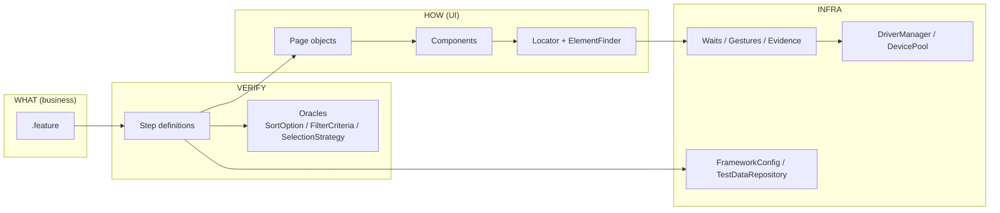
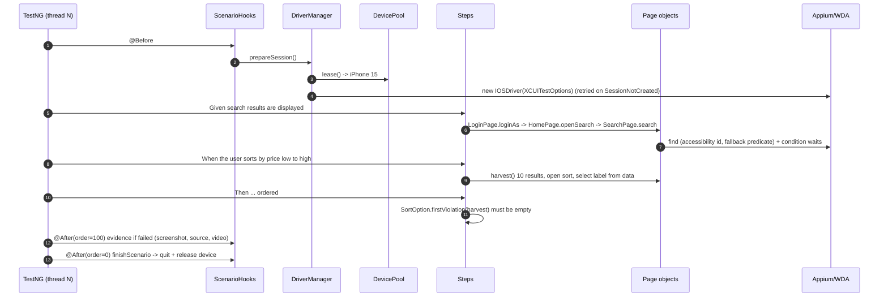
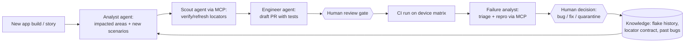

# Architecture & design rationale

## 1. Goals that shaped the design

| Goal | Consequence in the code |
|---|---|
| Tests fail only when the **product** is wrong | Business-rule oracles (`SortOption`, `FilterCriteria`), condition-based waits, evidence on failure |
| A UI change costs minutes, not days | `Locator` with ranked fallbacks + drift report; locators verified through Appium MCP |
| Scales from 1 simulator to a device farm | Thread-confined sessions, `DevicePool` leasing, config profiles, no static test state |
| AI can contribute safely | Small, well-named extension points + `CLAUDE.md` + `CodeConventionsTest` |
| Anyone can read a failure | Descriptive assertion messages, Allure categories, AI triage report |

## 2. Layers and responsibilities

**SOLID in practice**
- *Single responsibility*: `IOSOptionsFactory` builds capabilities, `DriverFactory` creates sessions,
  `DriverManager` owns their lifecycle, `DevicePool` owns device allocation.
- *Open/closed*: new filters/sorts are data (`filters.json`) + one enum constant; new capabilities are YAML;
  new evidence types plug into `Evidence`.
- *Liskov*: every page is a `BasePage` with a `screenAnchor()`; journeys treat them uniformly.
- *Interface segregation*: steps depend on page intent methods, never on `IOSDriver`.
- *Dependency inversion*: step classes receive `ScenarioContext`/`BookingJourney` through constructor injection.

## 3. A scenario at runtime

## 4. Locator strategy

**Order of preference** (encoded in `Locator.Builder`):

1. `accessibilityId` - an explicit contract with iOS developers (`accessibilityIdentifier`), not localised,
   independent of layout. Fastest lookup.
2. `iOSNsPredicateString` / `iOSClassChain` - evaluated natively inside WebDriverAgent; robust when written on
   type + stable attributes.
3. `xpathAsLastResort` - slow on iOS (WDA serialises the full tree) and brittle; the method name makes every
   use visible in code review, and `CodeConventionsTest` caps it at 10% of strategies.

**Rules:** no positional indexes for business elements; dynamic values (prices, dates) never appear inside a
locator; child elements are resolved *relative to their card*; labels coming from copy live in test data.

**Accessibility-id contract proposed to the iOS team** (`screen_element_role`):

| Screen | Identifiers |
|---|---|
| Login | `login_username_field`, `login_password_field`, `login_submit_button`, `login_error_message` |
| Home | `home_screen`, `home_search_entry`, `home_greeting_label` |
| Search | `search_destination_field`, `search_suggestion_<n>`, `search_dates_field`, `search_calendar`, `search_adults_stepper`, `search_submit_button` |
| Results | `search_results_list`, `result_card_<n>`, `result_card_name/location/price/rating/type/sold_out`, `search_results_filter_button`, `search_results_sort_button`, `active_filter_chip`, `search_results_sort_summary`, `search_results_empty` |
| Filter / Sort | `filter_screen`, `filter_options_list`, `filter_apply_button`, `filter_reset_button`, `sort_screen`, `sort_apply_button` |
| Details | `booking_details_screen`, `details_property_name`, `details_location`, `details_price`, `details_rating`, `details_gallery`, `details_book_button` |

Adding identifiers is a one-line change per view for developers and the single biggest stability win -
it also improves VoiceOver testing.

## 5. Synchronisation

- Implicit wait is **0** for the whole session (mixing implicit and explicit waits multiplies timeouts and makes
  fallback probing slow).
- `Waits.until(condition, timeout, description)` is the only primitive; every timeout says *what* never happened.
- Purpose-built conditions instead of delays:
  - loaders: `LoadingIndicatorComponent.waitUntilGone()`
  - async lists: `Waits.untilStable(cellCount)` / `untilStable(firstVisibleName)` after scrolls and filter/sort
  - keyboard: `KeyboardComponent.waitUntilShown()`; dismissed before tapping buttons it can cover
  - system alerts: handled explicitly (`AlertComponent`), not with `autoAcceptAlerts`, so permission flows stay testable
- `appium:reduceMotion=true` removes most animation timing issues.
- Timeouts are configuration (`wait.*`), larger in `ci.yaml` - never edited in code.

## 6. Test data

- `TestDataRepository` serves typed models from JSON by alias; every domain declares a `default` alias so steps
  read naturally ("valid search criteria") while data stays changeable.
- Secrets: `${ENV}` placeholders -> `.env` locally, CI secrets in pipelines; `Credentials.toString()` masks the password.
- Dates are offsets from today; selection of "a valid result" is a strategy (`FIRST_BOOKABLE`, `CHEAPEST`, ...).
- Scale-out path: per-environment folders (`testdata/<env>/`) and a test-data API / seeded accounts per thread
  (parallel scenarios must not share a mutable account, e.g. saved favourites).

## 7. Senior SDET questions

**Why this architecture?**
Four layers with one reason to change each: Gherkin changes with the business, steps with the rules, pages with
the UI, infra with the platform. That is what keeps maintenance local as the suite grows. The custom `Locator`
abstraction exists because locator change is the dominant maintenance cost in mobile UI automation.

**Why this locator strategy?** See section 4: accessibility ids are a contract, native predicates are fast and
expressive, XPath is the exception. Fallbacks buy time; drift reporting makes sure that time is used.

**How do you handle flaky mobile tests?**
1. *Prevent*: condition waits only, reduce motion, deterministic simulator state (locale, keyboard, status bar),
   one device per thread, fresh session per scenario in CI, data that never expires.
2. *Detect*: one rerun in a fresh session; pass-after-fail is labelled flaky in Allure and in the AI report;
   track flaky rate per scenario over time (Allure history / trend).
3. *Fix, don't mask*: the failure analyst classifies the cause (sync, locator, data, infra); a flaky test gets an
   owner and a deadline or is quarantined with `@wip` + ticket - never "retry 3 times".
4. Infra flakiness (WDA start) is retried at session creation only, with logging, so it does not pollute results.

**How would you scale the framework?**
- *Suite size*: tag tiers (smoke on PR, regression nightly), API/unit tests for logic that does not need UI
  (ordering across pages, price calculation), login via launch argument/deep link instead of UI for non-login
  features (largest time saver), shard by feature across CI jobs.
- *Team size*: page objects per feature team, shared components, `CLAUDE.md` + convention tests as reviewable rules,
  AI agents for scaffolding.
- *Devices*: see next answer.

**How would you execute tests on multiple iOS devices?**
`device.pool` lists devices; each TestNG thread leases one (`DevicePool`) with a unique `wdaLocalPort`, so
`-Dthreads=N` runs N sessions in parallel on N simulators (`scripts/boot-simulators.sh N`) or N real devices.
For coverage across models, run the pipeline as a matrix (device type x iOS version) or use a device cloud
(`config/cloud.yaml`). Beyond one Mac, Appium sessions can be distributed with a Selenium Grid 4 relay or a
cloud provider; the framework only needs `appium.url`.

**How would you handle different iOS versions?**
Version is data (`device.platformVersion`, per-device override `name@udid@version`). The XCUITest driver abstracts
most differences; for the rest: prefer accessibility ids (stable across UIKit/SwiftUI changes), keep
version-specific behaviour (alerts, keyboards, pickers) inside components with a version check rather than in
pages, run a version matrix nightly (N, N-1, N-2 per analytics), and tag version-specific scenarios.

**How would you manage test data?** Section 6. In addition: data that tests create is created via API in
`@Before` and cleaned up in `@After`; read-only reference data (destinations) is chosen so filters are selective;
production-like data is never used for destructive flows.

**How would you detect stale or changed locators?**
- At runtime: fallback hits are logged and written to `locator-drift-report.json`, attached to Allure, fed to the
  failure analyst.
- On failure: Allure category "Locator / UI change" + page source attachment.
- Proactively: a scheduled `locator-scout` MCP job can re-verify all primary locators against each new app build
  and open a PR with changes (human-approved). Accessibility ids in the iOS codebase can also be linted against
  the contract table.

**Where does AI add value?** Turning stories into risk-ranked test ideas and ambiguities; exploring the live app and
proposing verified locators through MCP; scaffolding page objects/steps that follow conventions; first-pass code
review; clustering failures and drafting bug reports. It removes typing and searching, not thinking.

**Where should AI NOT be trusted?** Deciding expected behaviour (oracles come from requirements/PO, not from what
the app currently does); inventing locators it has not observed; declaring a failure "flaky" or "not a bug"
without evidence; weakening assertions to get green; handling credentials or customer data; final merge decisions.

**What role does MCP play?** MCP gives the agent *hands and eyes* on the device through a standard tool protocol:
start a session, read the element tree, tap, type, screenshot. It is used at **design time** (exploration, locator
discovery, failure reproduction). The regression suite itself stays deterministic Java against Appium - it does
not depend on a model at runtime. Details in [APPIUM_MCP.md](APPIUM_MCP.md).

**How would you integrate AI failure analysis?** Already in CI: `analyze_failures.py` runs after every job,
clusters and classifies deterministically, then optionally asks Claude for hypotheses; the report goes to the job
summary and as JSON to chat/Jira bots. Next steps: feed Allure history (flake rate), app/Git diffs between builds
(correlate failures with changed screens), and let the `failure-analyst` reproduce locator failures via MCP and
open draft PRs.

**How would you evolve this into an autonomous QA workflow?**

Autonomy grows step by step, measured by precision: agents first *suggest*, then *open PRs*, then *auto-merge
low-risk changes* (e.g. a locator verified on two devices with green runs) - while expected behaviour and release
decisions stay human.
